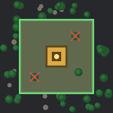

# Tidy Roboports



A Factorio 2.0 mod: roboports keep their surroundings tidy. They tell you how much debris lies around them and have their robots clear it away, little by little, without you placing a single deconstruction planner.

## What it does

- **Debris count on hover.** Hover over a roboport and its info panel shows how much debris is inside its construction range (the green area): items on the ground, trees, rocks, and cliffs.
- **Automatic, gradual cleanup.** Every roboport marks debris inside its own construction range for deconstruction, and its network's construction robots remove it. Only a few pieces are marked at once, so cleanup never swamps your robots while you are building.
- **No stalling on things robots cannot remove.** Cliffs are left alone while the network has no cliff explosives, and items on the ground while the network has no storage space for them. Such debris does not block the rest of the cleanup, and it is picked up again once it becomes removable.
- **Stays inside the green area.** A piece of debris is in range when its center is; pieces that only overlap the edge from outside are neither counted nor marked.
- **Only working roboports clean up.** A roboport with low or no power pauses; debris that is already marked stays marked.
- **Built for big bases.** At most one roboport is looked at per game tick, so the mod's cost does not grow with the number of roboports. With many hundreds of roboports, each one simply gets its turn a little less often.

## Setting

| Setting | Where | Default | Meaning |
|---|---|---|---|
| Maximum marked debris per roboport | Map settings | 1 | How many pieces of debris in a roboport's range may be marked for deconstruction at once. Debris you marked yourself counts too. `0` turns automatic marking off; the debris count on hover keeps working. |

The setting can be changed in a running game.

## Compatibility

- Factorio 2.0. Needs only the base game; Space Age is not required. With Quality enabled, cliff explosives of any quality count.
- Trees, rocks, and cliffs added by other mods are recognized when they use the usual prototype types (rocks: the same flag the deconstruction planner's "trees and rocks only" filter uses).
- Safe to add to and remove from an existing save. Debris that is marked at the time of removal stays marked.
- Multiplayer: the debris count replaces the roboport's status line while someone hovers over it.

## License

[MIT](LICENSE)

---

The rest of this page is for contributors.

## Local development

The repository root is the mod folder (`info.json` lives here). Factorio loads a mod folder named `<name>` or `<name>_<version>`, so link the clone into the mods directory:

```powershell
New-Item -ItemType Junction -Path "$env:APPDATA\Factorio\mods\tidy-roboports" -Target (Get-Location)
```

Then start Factorio and enable the mod in the mod list.

## Pull request checks

Every push to a pull request runs the "Mod checks" workflow:

- `info.json` is valid and has the fields Factorio requires.
- `changelog.txt`, once it exists, is in exactly the format Factorio accepts and its newest version matches `info.json` (headless Factorio does not read the changelog, so this is checked separately).
- All Lua files are syntactically correct.
- The release package builds, loads in the current stable headless Factorio with the base game alone, and its scripts run without errors. A small harness mod (`.github/ci/harness`) builds a powered and an unpowered roboport with debris around them and fails the check when the powered one marks nothing or the unpowered one marks something.

A failing check names the problem in the pull request's check report; the full Factorio log is in the workflow run.

## Release

Releases are made on GitHub only: **Actions → Release → Run workflow** on `main`, choosing which part of the version to raise (`patch` by default, `minor`, or `major`).

The workflow then

1. raises `version` in `info.json` (e.g. 0.1.0 → 0.1.1),
2. adds the new version to `changelog.txt`, the changelog Factorio shows in-game and the mod portal shows on the mod page (see below),
3. runs the same checks as for pull requests against that state, which builds the package and loads it in Factorio, changelog included,
4. records the release commit (`info.json` and `changelog.txt`) on `main`,
5. publishes a GitHub release tagged with the version, with the package `<name>_<version>.zip` attached and the new changelog entries as release notes.

When a check fails, nothing is pushed: no version change, no changelog entry, no tag, no release.

The changelog is written from the pull requests merged since the last release, one entry each, worded like the issue the pull request belongs to. Labels decide where an entry goes:

| Label on the pull request | Changelog |
|---|---|
| `enhancement` | Features |
| `bug` | Bugfixes |
| `internal` | no entry: tooling and other things players do not notice |
| anything else | Changes |

A release without any listed pull request gets the single entry "No player-facing changes." `changelog.txt` is never edited by hand.

- The package contains only runtime files (`info.json`, `changelog.txt`, `thumbnail.png`, `LICENSE`, top-level `*.lua`, `locale/`, `migrations/`, `prototypes/`, `graphics/`). Extend `$runtimePatterns` in `tools/package.ps1`, the build step used by the workflows, when the mod gains other runtime folders.
- Uploading the package to the mod portal is a manual step: download it from the GitHub release.
- `main` only takes changes through pull requests. The workflow pushes the version commit as a GitHub App that is a bypass actor of that rule; it expects the app's ID in the repository variable `RELEASE_APP_ID` and its private key in the secret `RELEASE_APP_PRIVATE_KEY`.
